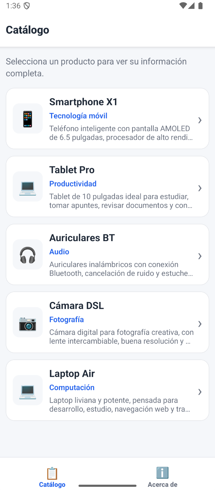

# Aplicación móvil Navegación - Semana 3

Aplicación móvil desarrollada con React Native CLI y React Navigation. Integra navegación por pila, navegación por pestañas inferiores y paso de datos entre pantallas mediante parámetros de ruta.

- Ingeniería Informática - 7mo "A"
- Desarrollo de aplicaciones móviles con React Native
- Desarrollado con React Native CLI + TypeScript

  

## Descripción

La aplicación muestra un catálogo básico de productos tecnológicos. Desde la pantalla principal, el usuario puede seleccionar un producto y navegar hacia una pantalla de detalle, donde se visualiza la información completa del item seleccionado.

El proyecto implementa React Navigation usando una combinación de Bottom Tabs y Stack Navigator. La pestaña Catálogo contiene la navegación por pila entre la lista y el detalle, mientras que la pestaña Acerca de muestra información estática de la aplicación.

El proyecto fue desarrollado tomando como referencia el documento "Semana3_Navegación.pdf" de la actividad ubicado en la carpeta `documents/` del repositorio.

## Funcionalidades

- Navegación principal mediante Bottom Tabs.
- Navegación por Stack dentro de la pestaña Catálogo.
- Lista de 5 productos tecnológicos.
- Pantalla de detalle con nombre, categoría, descripción e imagen del producto.
- Paso del objeto completo del producto mediante parámetros de ruta.
- Recuperación de datos en la pantalla de detalle con `useRoute()`.
- Botón "Volver al catálogo" usando `navigation.goBack()`.
- Pestaña "Acerca de" con información de la app.
- Iconos personalizados en las pestañas usando emojis.
- Separación del código por navegación, pantallas, componentes, hooks, tipos y estilos.

## Pantallas de la aplicación

| Pantalla | Descripción |
|---|---|
| Catálogo | Muestra la lista de productos disponibles. |
| Detalle | Muestra la información completa del producto seleccionado. |
| Acerca de | Muestra información general de la aplicación, materia e integrantes. |

## Estructura de navegación

La aplicación utiliza la siguiente estructura:

- NavigationContainer
  - Bottom Tab Navigator
    - Catálogo
      - Stack Navigator
        - ListaScreen
        - DetalleScreen
    - Acerca de
      - AcercaDeScreen

## Datos de prueba utilizados

| Producto | Categoría |
|---|---|
| Smartphone X1 | Tecnología móvil |
| Tablet Pro | Productividad |
| Auriculares BT | Audio |
| Cámara DSL | Fotografía |
| Laptop Air | Computación |

## Estructura principal

- `App.tsx`
- `src/app/AppNavigator.tsx`
- `src/navigation/RootTabsNavigator.tsx`
- `src/navigation/CatalogStackNavigator.tsx`
- `src/navigation/navigationTypes.ts`
- `src/features/catalog/domain/CatalogItem.ts`
- `src/features/catalog/data/catalogItems.ts`
- `src/features/catalog/hooks/useCatalogItems.ts`
- `src/features/catalog/components/CatalogCard.tsx`
- `src/features/catalog/screens/ListaScreen.tsx`
- `src/features/catalog/screens/DetalleScreen.tsx`
- `src/features/about/screens/AcercaDeScreen.tsx`
- `src/shared/components/ScreenContainer.tsx`
- `src/shared/styles/colors.ts`
- `src/shared/styles/spacing.ts`
- `src/shared/styles/radius.ts`
- `src/shared/styles/typography.ts`

## Componentes utilizados de React Native

- View
- Text
- FlatList
- Pressable
- StatusBar
- StyleSheet

## React Navigation utilizado

- NavigationContainer
- createBottomTabNavigator
- createStackNavigator
- useNavigation
- useRoute
- NavigatorScreenParams
- RouteProp
- StackNavigationProp

## Requerimientos técnicos cumplidos

- Configuración de `@react-navigation/native`.
- Configuración de `@react-navigation/stack`.
- Configuración de `@react-navigation/bottom-tabs`.
- Uso de `NavigationContainer` en la raíz.
- Stack Navigator anidado dentro de Bottom Tab Navigator.
- Paso de datos con `navigation.navigate('DetalleScreen', { item })`.
- Recepción de parámetros con `useRoute()`.
- Renderizado dinámico de datos en `DetalleScreen`.
- Botón de regreso con `navigation.goBack()`.
- Personalización de `tabBarIcon`.
- Tipado de rutas con TypeScript.
- Separación ordenada del proyecto por responsabilidades.

## Instalación y ejecución

Instalar dependencias:

`npm install`

Ejecutar Metro:

`npm run start`

Ejecutar en Android:

`npm run android`

Ejecutar en iOS:

`cd ios`

`pod install`

`cd ..`

`npm run ios`

## Nota técnica

Durante las pruebas puede mostrarse el warning:

`InteractionManager has been deprecated and will be removed in a future release.`

Este aviso no proviene del código desarrollado en `src`, ya que el proyecto no utiliza `InteractionManager` directamente. La aplicación funciona correctamente y el warning no afecta la navegación ni el paso de parámetros.

## Autor

Paúl Terán  